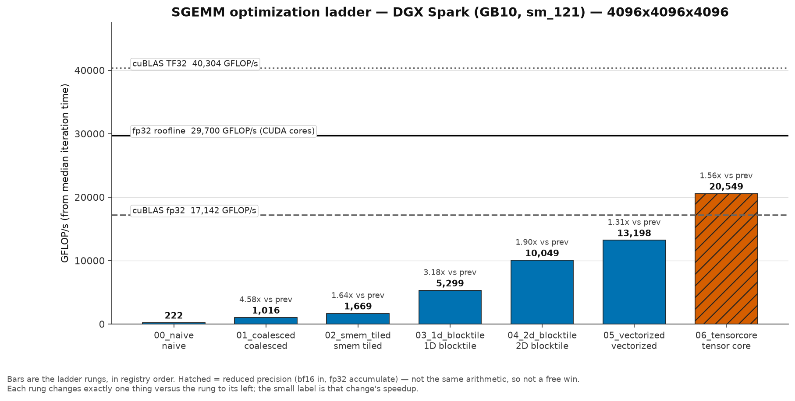
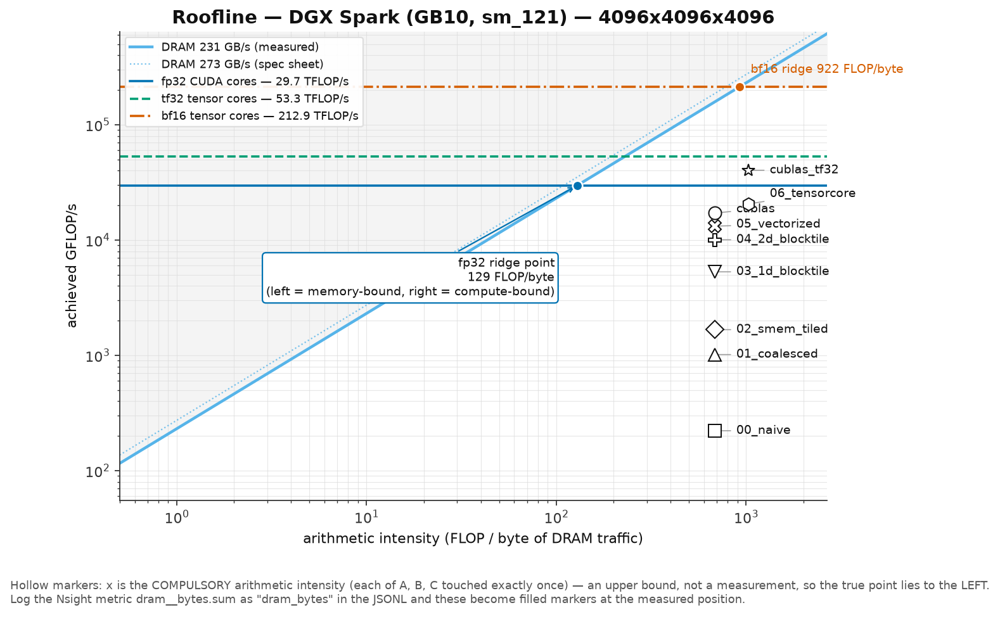
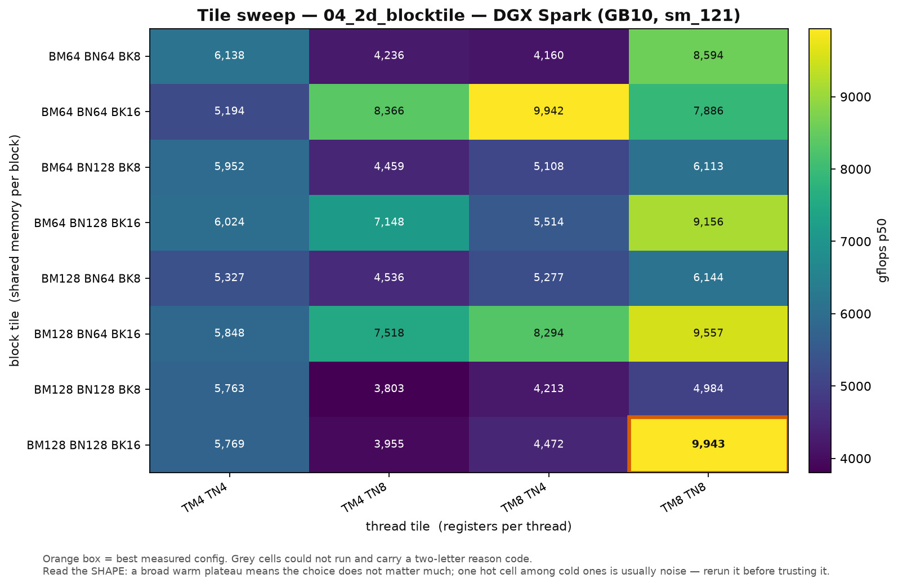
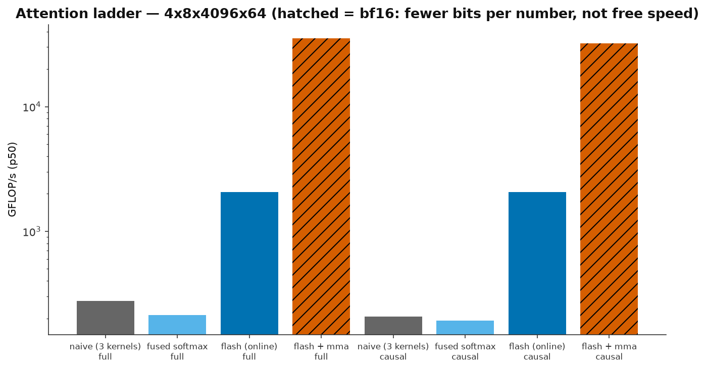
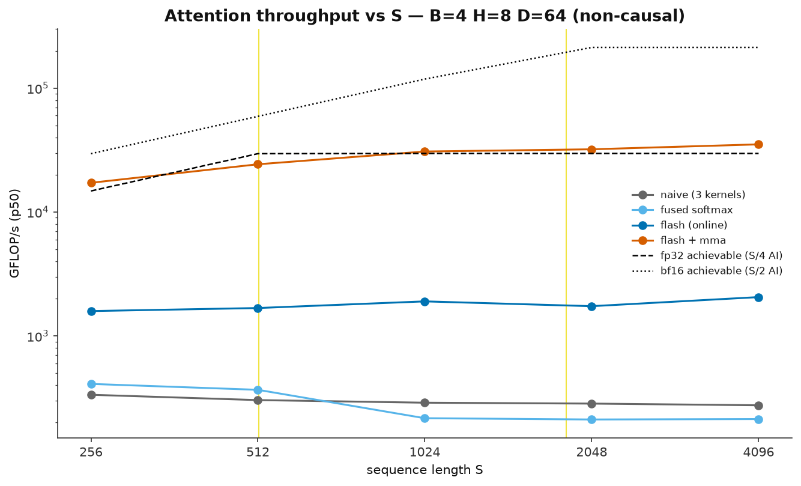

# kernel-ladder

CUDA kernels for the two layers that dominate transformer inference — SGEMM and
attention — taken from a naive implementation to past fp32 cuBLAS on an NVIDIA
DGX Spark (GB10 Grace Blackwell, sm_121). I structured the work as a ladder:
each kernel changes exactly one thing relative to the previous one, every claim
is gated by a CPU oracle before it is timed, and no rung counts as finished
until Nsight Compute can name the metric that changed. The deliverable is not
just the fastest kernel — it is the measured record of what each optimization
bought, what it cost, and why.

Headline results, all p50 over 100 iterations on an otherwise-idle GPU:

- **SGEMM 4096³:** naive 222 GFLOP/s → 20,549 GFLOP/s (bf16 tensor cores,
  raw `mma.sync`) — **1.20x faster than fp32 cuBLAS** on the same problem,
  and 38.2 TFLOP/s at 2048³.
- **Attention 4×8×4096×64:** naive 275 GFLOP/s → 35,153 GFLOP/s
  (FlashAttention with both matmuls on tensor cores) — **127x**.
- At S=32768 the naive path cannot even allocate its 137 GB score matrix;
  the flash kernel runs the same problem in 4.9 s/iteration.

---

## Results: the SGEMM ladder

4096×4096×4096, p50 GFLOP/s, every kernel verified against a
double-accumulated CPU oracle before timing.

| # | Kernel | The one change | GFLOP/s | vs prev | vs cuBLAS fp32 |
|---|--------|----------------|--------:|--------:|---------------:|
| 0 | `00_naive` | one thread per output; threads index the strided dimension | 222 | — | 0.01x |
| 1 | `01_coalesced` | `threadIdx.x` indexes the contiguous (column) dimension | 1,016 | 4.58x | 0.06x |
| 2 | `02_smem_tiled` | 32×32×32 tiles of A and B staged in shared memory | 1,669 | 1.64x | 0.10x |
| 3 | `03_1d_blocktile` | TM=8 outputs per thread; one hoisted B read feeds 8 FMAs | 5,299 | 3.18x | 0.31x |
| 4 | `04_2d_blocktile` | 8×8 register tile per thread + a 32-config tile sweep | 10,049 | 1.90x | 0.59x |
| 5 | `05_vectorized` | `float4` for every load/store + transposed A tile | 13,198 | 1.31x | 0.77x |
| 6 | `06_tensorcore` | bf16 `mma.sync` + `ldmatrix` + 2-stage `cp.async` | 20,549 | 1.56x | **1.20x** |

Baselines on the same harness: **cuBLAS fp32 (strict) 17,142 GFLOP/s** — 57.7%
of the 29.7 TFLOP/s fp32 ceiling — and **cuBLAS TF32 40,304 GFLOP/s**. The
bf16 rung is compared honestly: it beats fp32 cuBLAS at the same output while
reaching 51% of cuBLAS TF32, its actual precision-class baseline.





Rung 4's number came out of a 32-configuration tile sweep, and the sweep's
entire win over the textbook default was one parameter: **BK 8 → 16** (half the
barriers per FLOP, twice the work per pipeline stage; 5,178 → 10,049 GFLOP/s).
Every BK=8 configuration finished at or below 8.6 TFLOP/s; every TM=TN=4
configuration finished in the bottom third. On this part, arithmetic density
beats occupancy.



## Results: the attention ladder

B=4, H=8, D=64, non-causal, p50 at S=4096. Full S-sweep and causal numbers in
`bench/results/attention.jsonl`.

| # | Kernel | The one change | GFLOP/s | vs prev |
|---|--------|----------------|--------:|--------:|
| 0 | `00_naive_attention` | 3 kernels; materializes the B×H×S×S score matrix | 275 | — |
| 1 | `01_fused_softmax` | QKᵀ + softmax in one kernel, warp-shuffle reductions | 213 | **0.77x — a measured loss** |
| 2 | `02_flash_tiled` | online softmax, K/V tiled, O(S) memory | 2,058 | 9.7x |
| 3 | `03_flash_tensorcore` | both matmuls on bf16 `mma.sync` | 35,153 | 17.1x |

The fused-softmax rung is slower at large S and I kept it in the ladder on
purpose: the profiler shows its writes shrink 17x while its K-read traffic
grows 5x (one block per query row re-streams all of K with nothing amortizing
it). Fusion without locality is not a win, and that finding is the exact
motivation for the tiling that follows. Causal masking in the flash kernels is
a genuine ~2x (75.9 → 39.0 ms at S=4096) because fully-masked K/V tiles are
skipped, not computed and discarded.





## The memory wall, demonstrated

The reason FlashAttention exists, reproduced on this machine's 121 GB of
unified memory:

```
$ ./build/attention --size 4x8x32768x64 --only 00_naive_attention --no-verify
Cannot allocate the 137.44 GB B*H*S*S score matrix (87.57 GB free).
    at S=65536 it would be 549.756 GB; it grows as S^2

$ ./build/attention --size 4x8x32768x64 --only 02_flash_tiled --no-verify
02_flash_tiled    fp32    4931.699 ms    1783.6 GFLOP/s    ok
```

S=8192 (an 8.6 GB score matrix) still *succeeds* on this box, so I pushed the
demonstration to where the O(S²) allocation actually fails while the O(S)
kernel keeps running.

## How I keep the numbers honest

- **Correctness gates every benchmark.** A double-accumulated CPU oracle
  checks every kernel before it is timed; a wrong kernel is never benchmarked.
  Tolerances are per-precision (2e-4 fp32, 2e-2 bf16) and the measured max
  relative error is published beside every GFLOP/s.
- **The error metric had to be designed, not assumed.** Pure per-element
  relative error is unsatisfiable for GEMM with mixed-sign data — even cuBLAS
  "fails" it, because outputs near zero carry accumulation noise that is huge
  relative to that element while being ~1e-7 of the problem scale. I floor the
  comparison denominator at the problem's natural output scale, √K.
- **No single-shot timing.** 25 warmup + 100 timed iterations with CUDA
  events; p50/p90/p99 and coefficient of variation reported; cv > 5% is
  flagged rather than silently averaged away.
- **GB10 cannot lock clocks** (`nvidia-smi -lgc` is a no-op), so every result
  records the SM clock sampled before and after the measurement. A speedup
  that arrived with a clock increase is not a speedup.
- **Benchmarks require an exclusive GPU.** I learned this the hard way: a
  background inference server halved throughput in a way that looked exactly
  like thermal throttling. The protocol is now `docker ps` + `nvidia-smi` for
  compute processes before any session.
- **Two baselines, matched by precision class.** Strict-fp32 cuBLAS and TF32
  cuBLAS both run in every session; bf16 kernels are judged against the
  latter. Comparing a bf16 kernel to strict fp32 stacks the deck.
- **Append-only logs.** Every run appends JSONL to `bench/results/`; charts
  are generated from the logs, never retyped.

## Design decisions

**Why beating fp32 cuBLAS was achievable.** I profiled the baselines with nsys
before trusting any comparison against them: on sm_121, cuBLAS selects
`cutlass_80_simt_sgemm_128x128_8x4_nn_align1` (fp32) and
`cutlass_80_tensorop_s1688gemm_128x128_32x3_nn_align4` (TF32) — both sm_80
Ampere fallbacks. No sm_121-tuned path exists. That is precisely the opening
the bf16 tensor-core rung exploits, and it is also why I report it: an
unexplained win over a vendor library convinces nobody.

**Everything is built for what sm_121 actually is.** GB10 is *consumer*
Blackwell: no `wgmma` (Hopper), no `tcgen05` (datacenter Blackwell), and 99 KB
of shared memory per block. Published Hopper FlashAttention configurations
need 160+ KB and will not even launch here. So the tensor-core kernels are
built directly on `mma.sync.m16n8k16` + `ldmatrix` + `cp.async`, with tiles
sized against the 99 KB cap, and `make probe` verifies the instruction set
against ptxas rather than assuming it.

**The attention tensor-core kernel chains its two matmuls in registers.** The
fragment layouts line up: two n-adjacent 16×8 QKᵀ accumulator tiles *are* the
16×16 A-fragment the P@V `mma.sync` expects, so after the online-softmax
rescale the probabilities never touch shared memory. I kept the
shared-memory round trip as a compile-time alternative and verified the
register-permutation path bit-identical against it before adopting it.
Double-buffering the K/V staging with `cp.async` was worth a further +64%.

**Tile sweeps are first-class tooling, not one-off scripts.** The sweep
drivers rebuild each configuration, arithmetically reject impossible ones
(the 99 KB shared-memory and 1024-thread limits) with the reason logged,
verify correctness at a small size, and only then time. The SGEMM sweep found
BK=16; a 7-config attention sweep found Br=64/Bc=32 (+13.6% — 40 KB of shared
memory fits two resident blocks per SM where the 64×64 default fits one).

**Every kernel keeps a fallback path.** The `float4` kernel falls back to the
scalar 2D-blocktile for shapes not divisible by 4, the tensor-core GEMM to the
vectorized kernel for shapes not divisible by 16, and the tensor-core flash
kernel to the fp32 flash kernel for ragged S. Every shape is correct even off
the fast path, and `make run-ragged` exists to prove it.

**What I did not reach, stated plainly.** The best fp32 kernel stops at 77% of
fp32 cuBLAS (rung 4 at ~59%). The profiler names the remaining gap: cuBLAS's
kernel runs a 4-stage `cp.async` pipeline where my fp32 kernels are
single-buffered — pipelining is the technique that arrives in the tensor-core
rung, applied there to bf16 first. Similarly, the tensor-core GEMM's
2048³-vs-4096³ gap (38.2 vs 20.5 TFLOP/s) is the 64×64 block tile's DRAM
re-fetch bill once the matrices outgrow the 24 MB L2; a 128×128 warp-tiled
block is the shape of the next rung, and I would rather leave it named than
imply the ladder is finished.

## The PyTorch custom op

`torch_ext/` wraps the fastest fp32 rung as a real operator,
`torch.ops.kernel_ladder.sgemm` (torch 2.12.0+cu130), because a
microbenchmark speedup is a claim about a kernel and an end-to-end speedup is
a claim about a system. The op passes a full correctness suite — including
non-contiguous views, `nn.Module` composition, and
`torch.compile(fullgraph=True)` with no graph break, via a registered Meta
kernel — and through the dispatcher it runs at 0.78x of fp32 `torch.matmul`,
identical to the C++ harness ratio, so nothing is lost to binding overhead.

Inside a 4-layer MLP the kernel is 0.75x per-GEMM yet 1.10x end-to-end
against the fp32 baseline (Amdahl with p=0.56 caps the ceiling at 2.27x even
if GEMM were free). Against stock PyTorch defaults with TF32 enabled it is
0.46x — that is the honest bar for an fp32 kernel on this hardware, and the
benchmark prints it.

```bash
cd torch_ext
python setup.py build_ext --inplace
python test_op.py          # correctness, composition, torch.compile, benchmark
python bench_in_model.py   # the kernel inside an MLP; Amdahl accounting
```

## Usage

```bash
make check          # preflight: driver, CUDA version, clocks, profiling perms
make probe          # ask ptxas which tensor-core instructions sm_121 supports
make build          # CMake configure + compile (ARCH=121)
make test-host      # CPU oracle + statistics unit tests — no GPU needed
make run            # SGEMM ladder at 4096³ (override with SIZE=...)
make run-small      # 512³ — fast loop while developing
make run-ragged     # 1024x2048x512 — catches M/N transposition bugs
make run-attn       # attention ladder (override with ATTN_SIZE=BxHxSxD)
make report         # SGEMM table + charts from bench/results/sgemm.jsonl
make report-attn    # attention tables
make profile K=05_vectorized   # Nsight Compute on one kernel
make sanitize K=05_vectorized  # compute-sanitizer memcheck
make sass           # count load/store widths in SASS (LDG.E.128 after rung 5)
make sweep          # rung 4 tile-size sweep
```

GPU performance counters are admin-restricted by default
(`RmProfilingAdminOnly`); `scripts/profile.sh` uses a passwordless sudo rule
for `ncu` when one is installed and warns otherwise.

## Repository layout

```
src/common/      CPU oracle, benchmark harness, statistics, GB10 constants
src/sgemm/       the SGEMM ladder (rungs 00–06 + cuBLAS fp32/TF32 baselines)
src/attention/   the attention ladder (naive → fused → flash → tensor cores)
torch_ext/       the PyTorch custom op + in-model benchmark
bench/           report generators; results/ holds JSONL logs and charts
scripts/         preflight check, ISA probe, profiling, tile sweeps, ceilings
tests/           host-only unit tests for the oracles and statistics
examples/        standalone one-warp mma.sync fragment-layout demo
```

## Hardware notes: GB10 / sm_121

Numbers I measured or verified locally, since no public GB10 architecture
whitepaper exists.

| | |
|---|---|
| Machine | NVIDIA DGX Spark — GB10 Grace Blackwell, sm_121, 121 GB unified memory |
| DRAM bandwidth | 231 GB/s measured (spec sheet says 273; I use the measured number as the roofline slope) |
| fp32 (CUDA cores) | ~29.7 TFLOP/s, derived — not published |
| TF32 / bf16 tensor | 53.3 / 212.9 TFLOP/s measured; **FP8 equals the bf16 rate** — no 2x, unlike datacenter parts |
| Ridge points | fp32 ~129 FLOP/byte, bf16 ~922 — a naive GEMM starts at ~0.25 |
| Shared memory | **99 KB per block** (Hopper allows 228; Hopper flash configs will not launch) |
| Tensor-core ISA | `mma.sync m16n8k16`, `ldmatrix`, `cp.async` — **no `wgmma`, no `tcgen05`** |
| Clocks | cannot be locked; ~2.4–2.5 GHz sustained under load, so I log clocks per run instead |
| Profiler gap 1 | no `dram__*` counters on this SoC — I substitute `lts__t_sectors_op_read*` (L2 traffic and misses) |
| Profiler gap 2 | no hmma-cycles metric — I count `sm__inst_executed_pipe_tensor.sum` (it matches the theoretical mma count exactly) and verify HMMA/LDSM/LDGSTS in SASS |
| cuBLAS | falls back to sm_80 CUTLASS kernels; no sm_121-tuned path |

## Requirements

CUDA ≥ 12.9 (sm_121 needs PTX ISA 8.8; built and measured on 13.0) ·
CMake ≥ 3.24 · Python 3.10+ with matplotlib/pandas for reports · for the
custom op, a PyTorch build with sm_121 support (2.12.0+cu130 here) ·
Nsight Compute/Systems for the profiling targets.
